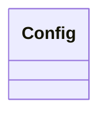
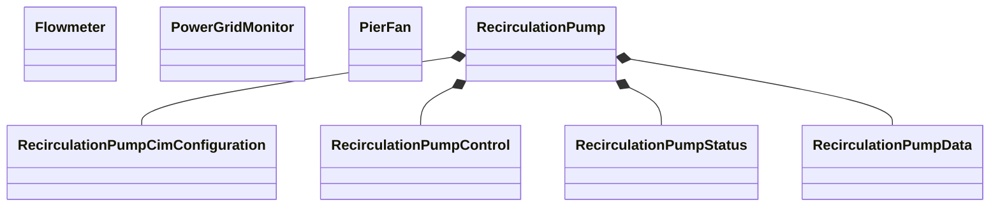
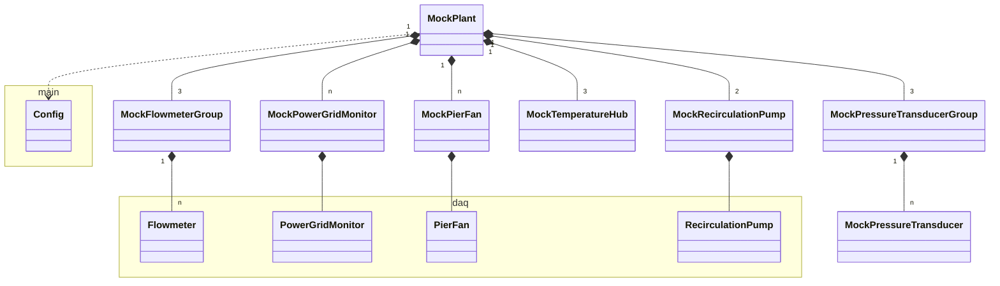

# Class Diagram

There are the following modules in the control system:

- [daq](#daq)
- [mock](#mock)

Show the main class diagram below:

## Daq

The [daq](../src/daq/) module implements the data acquisition process:

## Mock

The [mock](../src/mock/) module supports the simulation mode:

