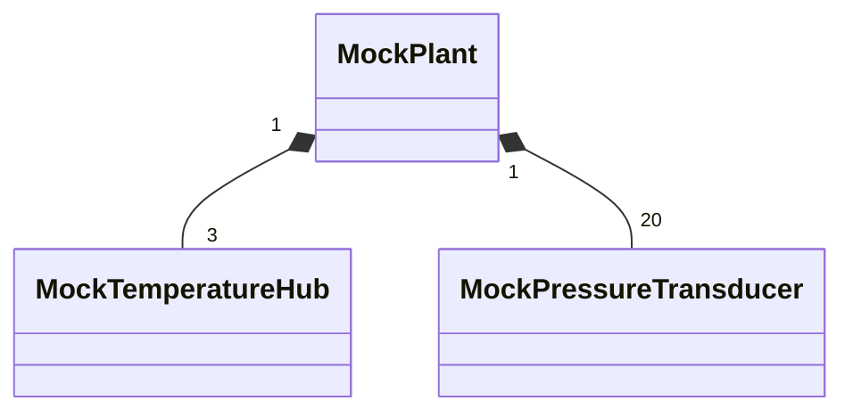

# Class Diagram

## Mock

The [mock](../src/mock/) module supports the simulation mode:

```mermaid
classDiagram

MockPlant "1" *-- "3" MockTemperatureHub
MockPlant "1" *-- "20" MockPressureTransducer
```
